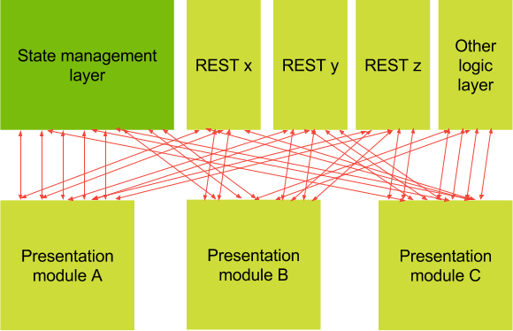
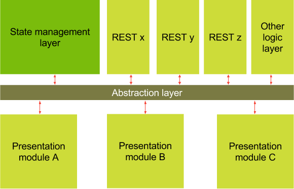
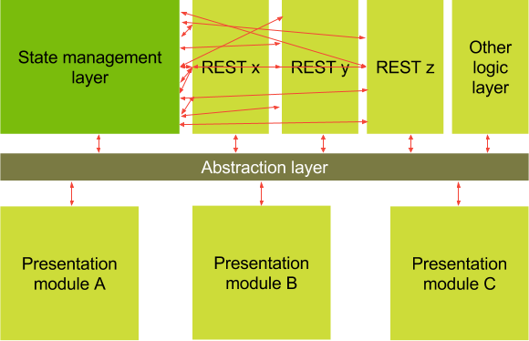
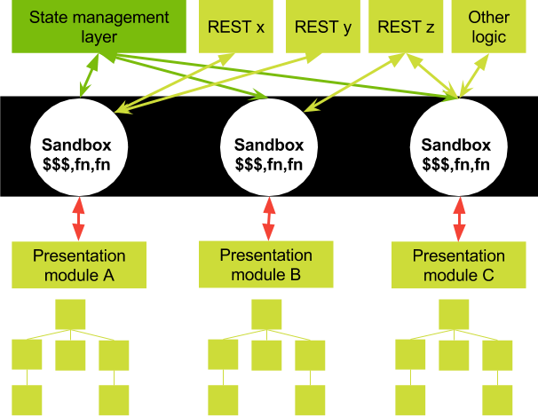

##Foreword

This article might be more relevant for [Angular 2](http://angular.io) developers, but I believe it can be used with other frameworks as well. It's just a handbook for writing scalable and maintainable single-page-applications. It's important to note, that this is not the only way, but it's a way that works for me in quite a few situations.

### Writing scalable Single-page-apps

A lot of developers are having trouble writing large-scale, maintainable single-page-applications. This results in early technical dept, a lot of frustration when fixing bugs, an eternal struggle when writing unittests and creating reusable chunks of code...

One of the biggest challenges might be: extending existing logic and writing new features based on a tricky foundation.

Single-page-applications are rather new (not really), and especially older frameworks gave you 100 different ways to design an application. There wasn't any structure, encapsulation and everything was tighly coupled to eachother.

Most of the time in the beginning of a project the development process went blazingly fast. But after a few developers, features, refactors, the code started to become less maintainable. It started to look like spaghetti. Frameworks have matured a lot, but it's also important that the architecture of the software you write matures along the process.

## SPA in 2016 (and even before)

To explain the architecture where this article is all about, here's a reminder of how a web-application in 2016 might look like.
These are concepts that your applications should rely on these days. It doesn't matter when using [React](https://facebook.github.io/react/), [Angular 2](http://angular.io) or something else. These principles are there to make sure that you web architecture becomes maintainable.

### Principle 1: Components

SPA-technologies like React and Angular2 make us use components. A component is a piece of HTML and javascript combined. We don't want to use standalone views or standalone controllers anymore.
They can grow exponentially and are related to eachother in a way that is hard to maintain.

So basically the philosophy here is:
**Everything should be a component**, even your pages and your application. An application could look like this:

```html
<application>
	<navbar fullname="Brecht Billiet" logout="logMeOut()">
	</navbar>
	<router-outlet>
		<users-page>
			...
			<grid data="users">
			</grid>
			...
		</users-page>
	</router-outlet>
</application>
```

Some very simple but very important tips in designing components:
<ul>
<li>Keep them as small as possible</li>
<li>Keep them as dumb as possible</li>
</ul>

If you are new to designing components, this article might be of help: [components demystified](http://blog.brecht.io/components-demystified)

### Principle 2: Unidirectional dataflow

Before, we used to update application state in a rather inefficient manner:
<ul>
<li>We tried to make sibling components communicate with eachother</li>
<li>Parent components tried to notify child components with actions</li>
<li>We tried to send events between different components</li>
<li>We used one-way binding, two-way binding</li>
<li>We injected models everywhere to share pieces of state</li>
</ul>

Did you ever tried to make sibling components communicate with eachother?
Sometimes it seems pragmatic to do so, but please don't.


**This is bad design!** It's almost impossible to see in which direction the data flows. I's also very hard to maintain this code, fix bugs in it or develop features.
What we do want, is a unidirectional dataflow like [Flux](https://facebook.github.io/flux/) or [Redux](http://redux.js.org/).

It basically looks like this: childcomponents only notify their parentscomponents, The parent will send an action to a store that contains state, and that action will update the state for the entire application. When that state is being updated, we can re-evaluate the component tree. Afterwards the data always flows in the same direction (downwards).


The big advantages of this approach are:
<ul>
<li>Decoupling components from eachother</li>
<li>Maintainability</li>
<li>The switch to real-time is much smaller, because the software is reactive</li>
<li>We can actually see what's going on by monitoring the actions</li>
</ul>

If you are new to unidirectional dataflows checkout the [introduction to redux](http://redux.js.org/docs/introduction/) and the part about [unidirectional dataflow](http://redux.js.org/docs/basics/DataFlow.html).


## A scalable architecture

I designed a certain architecture based on principles of today (most of them explained above) and even principles from 10 years back. Would I say it's the way to go for every SPA? Not at all... Every type of sofware deserves it's own architecture, and I'm just showing a concept that works for me in a lot of scenarios. This architecture might come in handy for developers that are writing [Angular 2](http://angular.io) where we can profit from awesome features like dependency injection, but it can also be applied in other frameworks (as explained above).


### Abstraction that makes sense

This principle is partially based on the [Sandbox principle](http://www.slideshare.net/nzakas/scalable-javascript-application-architecture) of [Nicholas Zakas](https://twitter.com/slicknet), which is allready a few years old. In that architecture, there was no unidirectional dataflow though.
For me a sandbox is a way to **decouple the presentationlayer from the application logic**, but that's not its only responsability.

But let's start from the beginning...
In this particular scenario I'm going to assume that we use [Redux](http://redux.js.org). However, it doesn't really matter what kind of statemanagement you use, but it's important that you know the principle behind it.

### Rule number ONE: Don't let your components play with all the toys

The same reason you don't let children play with everything: **"It might get messy"**.
Smart components (also named containers here) should also follow a very strict set of rules. We don't want to inject every service that we want in there, just because we can. For instance: it might not make sense to inject a game-engine in an authentication module. 

The following example shows a big constructor with a lot of dependencies. In this scenario the MyComponent can pretty much do whatever he wants in the application. He just injects whatever he wants and uses whatever he wants.
That's generally not a good idea.

```typescript
export class MyComponent{
	constructor(...,private foo:Foo, private bar: Bar, 
		private store: Store<ApplicationState>, private authService: AuthService,
		private fooHttpService: FooHttpService, private barMapper: BarMapper, ...){
	}
}
```

The example above has too much dependencies in its constructor. It has to many links to the rest of the application. When you persue this kind of design it might end up looking like this:


This is starting to look like a spaghetti, where everything is realy tightly coupled.
An abstraction layer could really help us here. In the example below we can see that the presentationlayer is completely decoupled and the abstraction layers delegates everything.



### Rule number TWO: Components should not know about the state management layer

Dumb components and smart components shouldn't know that you use Redux, or any other statemangement layer for that matter. They should not care how state is being managed. They just trust that it's being handled the right way. It's not their responsability. The responsability of the presentation layer is **"to present"** and **"to delegate"**.

The snippet below might be an example of bad design, it's very tightly coupled to redux (we use [ngrx/store](https://github.com/ngrx/store) in this example):

```typescript
export class MyComponent{
	// we just care about the state, not where it comes from...
	users$ = this.store.select(state => state.users);
	foo$ = this.store.select(state => state.foo);
	bar$ = this.store.select(state => state.bar);
	constructor(..., 
		private store: Store<ApplicationState>, ...){
	}
	
	addUser(user: User): void{
		// we don't care about the actiontype, payload or store
		this.store.dispatch({type: ADD_USER, payload: {user}}
	}
	removeUser(userId: string): void{
		// we don't care about the actiontype, payload or store
		this.store.dispatch({type: REMOVE_USER, payload: {userId}}
	}
}
```

This might be clearer, and more loosly coupled:

```typescript
export class MyComponent{
	users$ = this.facade.users$;
	foo$ = this.facade.foo$;
	bar$ = this.facade.bar$;
	
	constructor(private facade: ...){
	}
	
	addUser(user: User): void{
		this.facade.addUser(user);
	}
	removeUser(userId: string): void{
		this.facade.removeUser(userId)
	}
}
```

Now the component really focusses on its responsability. It doesn't know how the user will be added or removed, it doesn't know who populates the users$-stream, foo$-stream and bar$-stream. It gives that responsability to it's abstraction layer. Right now the presentation layer is completely decoupled from the rest of the application. Which brings the following advantages

<ul>
<li>We finally have encapsulation</li>
<li>Easier to test, we only have to mock the abstraction layer</li>
<li>If the abstractionlayer keeps it API, it can be developed parallel</li>
<li>It reacts on the abstractionlayer, so real-time development becomes easy</li>
<li>The presentationlayer is not coupled to the rest of the app anymore, so refactoring becomes easier</li>
</ul>


### Rule number THREE: HTTP services should not know about the statemanagement layer
It might look pragmatic to listen to the result of a get call and put it in the store right in the service. But the only goal an HTTP service has, is **to perform HTTP requests and return the result of those requests**.
This might look pragmatic:

```typescript
export class UserService{
	// expose the users$-stream directly in the service
	users$ = this.store.select(state => state.users);
	
	constructor(private store: Store<ApplicationState>, private http: Http){
	}
	
	fetchUsers(): void{
		this.http.get("...")
			.map(...)
			.subscribe((users) => {
				// when successful, put the users in the store
				// is this really my responsability?
				this.store.dispatch({type: SET_USERS, payload: {users}});
			});
	}
}
```

But now our http services are very tightly coupled to our state management system.


This is actually the only responsability an httpservice should have.

```typescript
export class UserService{
	constructor(private http: Http){
	}
	
	fetchUsers(): Observable<Array<User>>{
		return this.http.get("...").map(...)
	}
}
```

### A possible solution

This is not the only solution of course, but it's a solution that works mostly for me.
Every presentational module has access to its own sandbox. A sandbox is a service that will expose:
<ul>
<li>Streams of state (selected from redux in this case)</li>
<li>Methods of actions that the module (which consumes that sandbox) may execute</li>
</ul>

No **it's not just a facade** :) It should have a certain amount of logic.
<ul>
<li>Fetching the right pieces of state from the store</li>
<li>Dispatching the correct actions with the correct types and payloads to the store</li>
<li>Delegating to the right services of different modules</li>
<li>Handling [optimistic updates](http://blog.brecht.io/Cancellable-optimistic-updates-in-Angular2-and-Redux/)</li>
<li>If using something like firebase, exposing the correct streams from firebase</li>
</ul>



The advantages of the sandbox are:
<ul>
<li>Decoupling the presentation layer from the rest</li>
<li>Abstracting away the statemanagementlayer</li>
<li>You can see what a module has access to by opening it's sandbox</li>
<li>Components can not just use and break whatever they want, better encapsulation</li>
<li>Putting optimistic update logic in there seems like the right place because neither the component nor the service cares about that functionality</li>
<li>We can switch to a different kind of statemanagement without rewriting services and components</li>
</ul>

## Summary

This architecture is one way of doing things, but that doesn't mean that it's the only way.

I do believe it's very important to have encapsulation, loose-coupling and a decent structure of responsabilities. The frontend landscape evolves quickly, which means that we might want to be flexible for refactors/new technologies.
I hope you enjoyed the article.